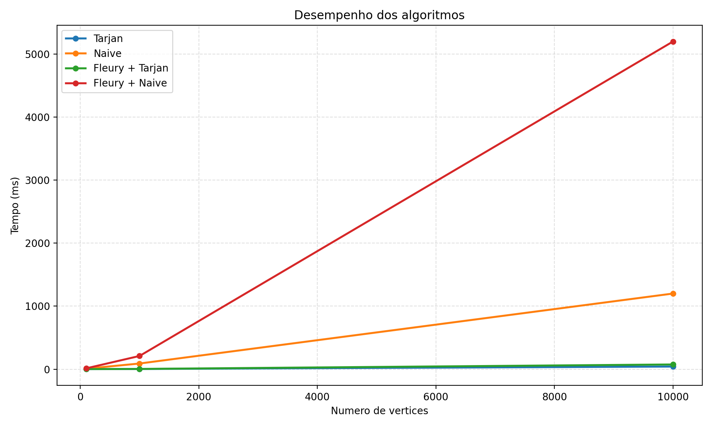

# Projeto de Grafos

<p align="center">
  
  
  
  
</p>

<p align="center">
  Implementacao em Java de algoritmos clássicos de grafos, com foco em detecção de pontes, classificação euleriana e execução do algoritmo de Fleury sobre instâncias de teste.
</p>

## Visao Geral

Este repositorio reune uma implementacao de estruturas e algoritmos estudados na disciplina de Grafos. O projeto trabalha com grafos não direcionados e usa uma representação baseada em `forward star` para armazenar adjacências de forma compacta.

Os principais componentes implementados sao:

- `Tarjan`: detecção de pontes usando DFS com vetores `discovery` e `low`.
- `Naive`: detecção de pontes por comparacao do numero de componentes conexas.
- `Fleury`: construção de caminho ou ciclo euleriano, evitando pontes quando possivel.
- `Grafo`: leitura de instâncias, armazenamento das arestas e montagem do `forward star`.
- Scripts em Python para geracao de instânncias e visualização de desempenho.

## O Que o Projeto Faz

O sistema permite:

- Ler arquivos `.txt` com instancias de grafos.
- Executar Tarjan para encontrar pontes.
- Executar o metodo Naive para encontrar pontes.
- Executar Fleury apoiado por Tarjan ou por Naive.
- Classificar grafos como `Ciclo Euleriano`, `Caminho Euleriano` ou `Não Euleriano`.
- Gerar e organizar conjuntos de exemplos para testes.
- Gerar graficos de desempenho a partir dos resultados.

## Estrutura do Repositorio

```text
.
|-- Main.java
|-- common/
|   |-- Grafo.java
|   |-- Aresta.java
|   `-- Vertice.java
|-- Tarjan/
|   `-- TarjanBridgeFinder.java
|-- NaiveBridge/
|   `-- NaiveBridgeFinder.java
|-- Fleury/
|   `-- Fleury.java
|-- exemplosGrafos/
|   |-- gerador_grafos.py
|   |-- gerador_grafos_ponte.py
|   `-- grafo_*.txt
|-- graficos/
|   |-- comparativo_geral.png
|   `-- por_algoritmo/
`-- graficos_desempenho.py
```

## Representacao do Grafo

O projeto usa uma combinação de estruturas para manter a implementação organizada:

- `pointer` e `arcDest` representam a adjacência com `forward star`.
- `arcArestas` associa cada arco do `forward star` a sua aresta real.
- `arestas` guarda o conjunto de arestas únicas do grafo.
- `indiceArestas` permite recuperar rapidamente a aresta correspondente ao par `(u, v)`.
- `graus` armazena o grau de cada vértice para apoiar a classificação euleriana.

Essa escolha deixa a travessia mais simples para os algoritmos, especialmente nos casos em que precisamos percorrer vizinhos e, ao mesmo tempo, consultar o estado da aresta associada.

## Algoritmos Implementados

### Tarjan

Detecta pontes em tempo linear sobre a estrutura do grafo usando busca em profundidade. Cada vertice recebe um tempo de descoberta e um valor `low`, o que permite verificar se uma aresta é uma ponte.

### Naive

Testa se uma aresta é ponte comparando o número de componentes conexos antes e depois de sua remoção lógica. É mais simples conceitualmente, mas tende a ser mais custoso.

### Fleury

Constrói um caminho euleriano ou ciclo euleriano removendo arestas gradualmente. Quando há mais de uma opção de remoção, o algoritmo tenta evitar pontes para não quebrar o restante do percurso.

## Arquivos de Exemplo

A pasta [`exemplosGrafos`](./exemplosGrafos) contém instâncias prontas para testes, incluindo:

- grafos eulerianos
- grafos semi-eulerianos
- grafos não eulerianos
- grafos com pontes

Os tamanhos atualmente presentes no repositório incluem:

- `100`
- `1000`
- `10000`
- `100000`

## Como Compilar

Requisito mínimo:

- JDK instalado e disponivel no terminal

Compilacao:

```bash
javac Main.java Fleury/*.java NaiveBridge/*.java Tarjan/*.java common/*.java
```

## Como Executar

Executar o menu principal:

```bash
java Main
```

Pelo menu, você pode:

1. executar Tarjan
2. executar Naive
3. executar Fleury com Naive
4. executar Fleury com Tarjan

Também é possivel executar algumas classes diretamente:

```bash
java NaiveBridge.NaiveBridgeFinder exemplosGrafos/grafo_ponte_100.txt
java Tarjan.TarjanBridgeFinder exemplosGrafos/grafo_ponte_100.txt
```

## Scripts Auxiliares

### Geracao de grafos

Gerar grafos eulerianos, semi-eulerianos e nao eulerianos:

```bash
python3 exemplosGrafos/gerador_grafos.py
```

Gerar grafos com pontes:

```bash
python3 exemplosGrafos/gerador_grafos_ponte.py
```

### Graficos de desempenho

O script [`graficos_desempenho.py`](./graficos_desempenho.py) organiza a geração de graficos a partir de medições de tempo em milissegundos.

## Saidas Visuais

Comparativo geral ja presente no repositório:



## Autores

Projeto desenvolvido para a disciplina de Grafos.

- Theo D. Viana
- Alex C. M. Marques
- Welbert J. A. de Almeida

## Link para o relatório no overleaf
https://www.overleaf.com/read/ckhjnyfrscvz#a3c47b
